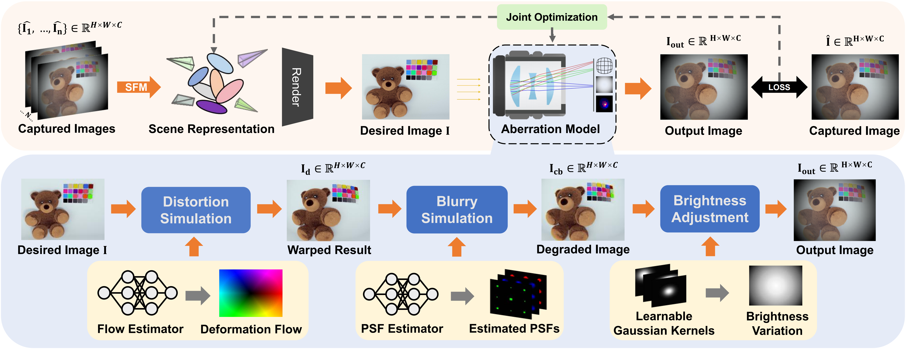

# Self-Calibrating-Fisheye-Lens-Aberration-for-Novel-View-Synthesis

The official implementation of paper "Self-calibrating Fisheye Lens Aberration for Novel View Synthesis"

We are sorting out the code and datasets and will upload them later.

## Introduction

  

We propose an end-to-end framework that addresses fisheye lens aberrations in novel view synthesis by combining a lens aberration model with a curriculum learning strategy. This approach ensures stable optimization, enhances reconstruction quality under multiple coexisting aberrations, and demonstrates robust generalization to scenes captured with non-fisheye lenses.

## Dataset

We will organize our AbeRec dataset and publish it at this link. https://drive.google.com/drive/folders/1jGRTtJlrlBQo_2xxFfpuG-d60WFIAXDd?usp=drive_link

The FisheyeNeRF provided by SC-NeRF is available at the following link. https://drive.google.com/file/d/1VhnpMUIKEak4TBpKY4H8vMJJe--FM2k5/view
